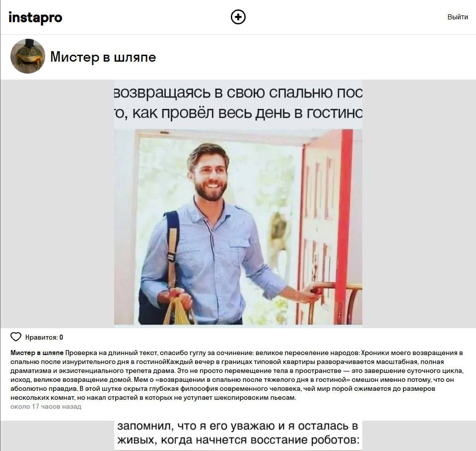
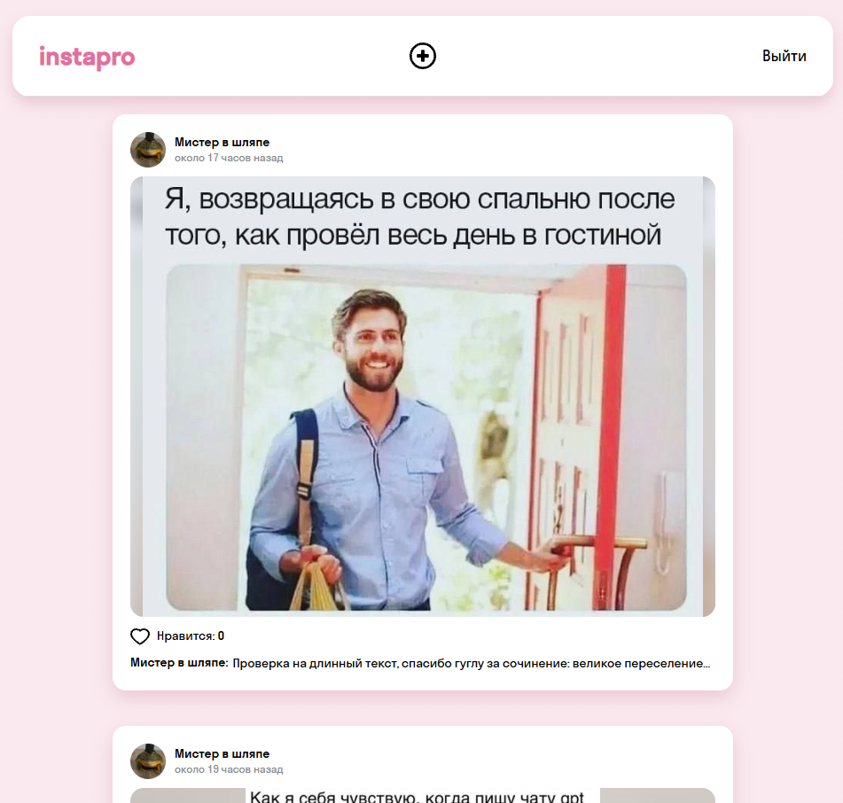

# Instapro 📷

**Instapro** — веб-приложение в формате социальной сети для публикации фотографий и взаимодействия между пользователями.

В приложении можно просматривать публикации, ставить и убирать лайки, открывать страницы пользователей, создавать собственные публикации и работать с комментариями.

## Демо

[Открыть приложение](https://methodgirl.github.io/webdev-cw-instapro/)

## Реализованная функциональность 🛠️

- Авторизация пользователя через API
- Обработка ошибок при работе с API
- Загрузка изображений через API
- Добавление и удаление лайков через API
- Получение и отображение публикаций
- Отображение автора, аватара, изображения и описания публикации
- Отображение даты создания публикации
- Отображение публикаций конкретного пользователя, переход на страницу пользователя по клику
- Создание новых публикаций
- Предпросмотр выбранного изображения
- Возможность заменить выбранную фотографию
- Добавление описания к публикации
- Проверка заполнения обязательных полей
- Обработка ошибок при создании публикации
- Обновление информации о лайках без перезагрузки страницы

## Дополнительные фичи 🚀

- Полностью переработана стилизация приложения
- Добавлены эффекты наведения (`hover`)
- Добавлены анимации элементов интерфейса
- Использованы градиенты
- Добавлен `blur`-фон для изображений нестандартных пропорций
- Реализована адаптивная версия для небольших экранов
- Добавлено раскрытие полного текста публикации по клику
- Добавлен предпросмотр изображения при создании публикации
- Добавлена возможность заменить выбранное изображение
- Изменена иконка лайка и её активное/неактивное состояния
- Настроено отображение имени первого пользователя, поставившего лайк, и количества остальных лайков
- Добавлена локализация относительной даты публикации на русский язык с помощью `date-fns`
- Отключена стандартная визуальная заливка браузера у автозаполняемых полей
- Изменён цвет текстового курсора (`caret`) в полях ввода в соответствии с дизайном приложения

## Изменение дизайна 🎨

В проекте была полностью переработана визуальная часть приложения: изменены стили элементов интерфейса, цветовая палитра, кнопки, состояния взаимодействия, отображение изображений и адаптивность.

### До

### После

## Технологии

- HTML5
- CSS3
- JavaScript
- REST API
- Fetch API
- date-fns
- Git
- GitHub Pages

## Первоначальная оценка времени ⌚

**2 недели**

## Фактически затраченное время

**Около 1 недели чистого рабочего времени**

## Автор

**MethodGirl**

[GitHub](https://github.com/MethodGirl)
